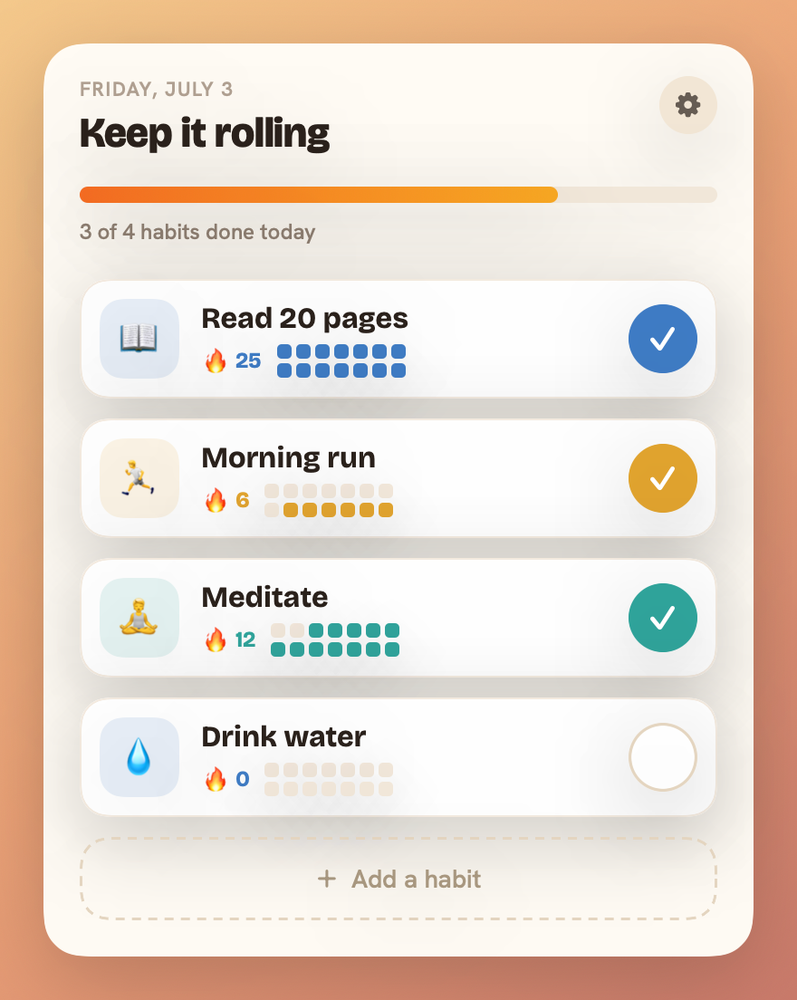
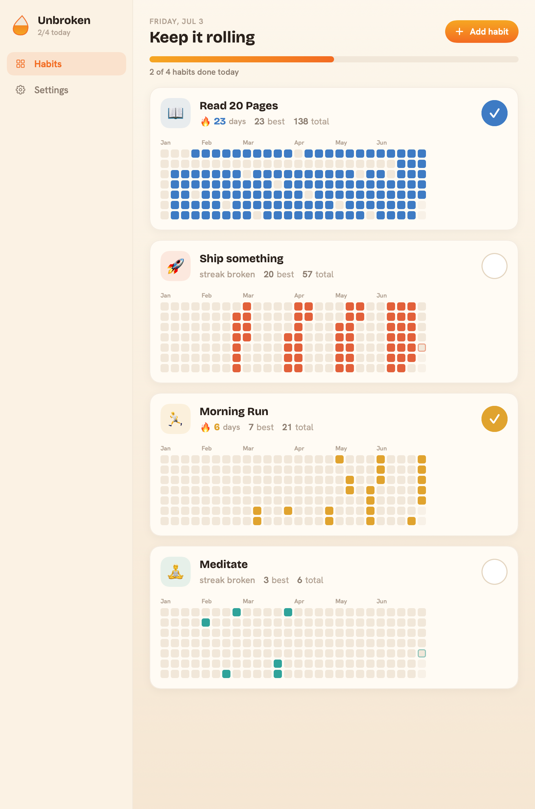

<div align="center">


# Unbroken

**Keep the streak. Watch the flame.**

A free, open-source habit tracker that lives in your Mac's menu bar.
No account, no sync, no subscription — just a flame that stays lit while you
show up, and turns orange when the day's almost gone and you haven't.


[](https://github.com/CyberVerse2/unbroken/releases/latest)



</div>

## Why it exists

Most habit apps are a separate place you have to remember to open. The whole
point of a streak is that it's *always on your mind* — so Unbroken puts it
where your eyes already are, in the menu bar, all day.

The icon **is** the app. One glance tells you where you stand:

| The flame | What it means |
|---|---|
| 🔥 faint outline | no habits yet |
| 🔥 hollow | a fresh day, nothing done |
| 🔥 filling up | some done, keep going |
| 🔥 solid | everything's done — you're good |
| 🔥 **orange** | day's ending and you're not done — don't break it |

Click it, check in, done. No streak-shaming, no notifications begging for
your attention — just a quiet flame that you don't want to let go out.

## Download

Grab the latest **[`Unbroken.dmg`](https://github.com/CyberVerse2/unbroken/releases/latest)**,
drag it to Applications, and it lives in your menu bar.

> **First launch:** the app is open-source and signed ad-hoc (not through a
> paid Apple Developer account), so macOS will warn you it's from an
> "unidentified developer." Right-click the app → **Open** → **Open** once, and
> you're set. Or [build it yourself](#build-from-source) — it's a plain Swift
> package.

## What you get

- **One-click check-ins** from a menu bar popover, with a quick onboarding that
  gets you a first habit in seconds.
- **A real history view** — GitHub-contributions-style grids for every habit,
  current streak, best streak, and totals.

<div align="center">

</div>

- **Streaks that are honest but not cruel.** Strict daily, with two mercies:
  - The day rolls over at **3 AM**, not midnight — a 12:30 AM check-in still
    counts for "today."
  - You can **backfill yesterday** if you forgot, but nothing older. No
    rewriting history.
- **A `unbroken` CLI** so you can check in from a terminal or a script.
- **Widget** (WidgetKit small + medium) built in — see the [note below](#widget).
- **Yours, locally.** One JSON file on your disk. No account, no cloud, no
  analytics, nothing leaves your Mac.

## The CLI

Check in without touching the mouse — great for shell prompts and scripts.

```sh
make cli                            # builds dist/unbroken
cp dist/unbroken /usr/local/bin/    # put it on your PATH

unbroken                 # list habits with today's status + streaks
unbroken done read       # check in "Read…" (matches by name prefix or emoji)
unbroken done gym --yesterday
unbroken undo read
unbroken status          # "2/4 done · at risk" — exits 0 only when all done
```

Everything lands in the same file the app reads, and the running app picks it
up live — a terminal `unbroken done` lights up the menu bar flame within a
heartbeat.

Because every check-in carries a `source` the streak engine never inspects,
anything can feed a streak — the CLI today, Shortcuts, a git-commit hook, or a
webhook tomorrow — without special-casing the streak logic.

## Build from source

Needs the Xcode 16+ command line tools (Swift 6). No `.xcodeproj` — it's a
plain Swift package.

```sh
make test    # run the engine test suite
make app     # build dist/Unbroken.app (menu bar + window + widget)
make run     # build and launch
```

`make app` assembles and ad-hoc-signs the bundle for local use.

## Widget

The widget is real, working WidgetKit code, packaged as a valid, signed
`.appex` inside the app. The catch: macOS refuses to register widgets from
ad-hoc-signed apps, so it won't appear in the widget gallery from a `make app`
build. A paid Apple Developer ID is the only unlock — the code and packaging
are already in place for whenever that happens.

## Contributing

Issues and pull requests are welcome. The streak logic lives in
`Sources/UnbrokenCore` and is covered by tests — if you touch it, keep them
green (`make test`).

## License

MIT — do what you like with it. See [LICENSE](LICENSE).
